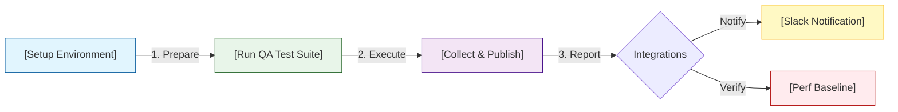

<p align="center">
  
</p>

<p align="center">
  <a href="https://github.com/carlos-camara/qa-hub-actions/actions"></a>
  <a href="https://github.com/carlos-camara/qa-hub-actions/releases"></a>
  <a href="LICENSE"></a>
</p>

<div align="center">
  <p>
    Welcome to the core automation engine of <b>QA Hub</b>. This repository contains a collection of professional-grade, reusable GitHub Actions designed to bring consistency, speed, and deep visibility to your testing pipelines.
  </p>
</div>

## 🔄 Pipeline Architecture

Our actions are designed to work in synergy, creating a seamless flow from environment setup to stakeholder notification.



## 📦 Available Actions

| Action | Icon | Status | Description |
| :--- | :---: | :---: | :--- |
| **[Setup Environment](./setup-environment)** | 🚀 | `Stable` | Multi-runtime (Node/Python) setup with smart caching. |
| **[Run QA Test Suite](./run-tests)** | 🧪 | `Stable` | Unit, API, GUI, and Performance test execution engine. |
| **[Collect & Publish](./collect-and-publish)** | 📊 | `Stable` | Aggregation of reports and PR-integrated summaries. |
| **[Slack Notification](./slack-notify)** | 📢 | `Beta` | Rich, formatted test status updates to Slack. |
| **[Perf Baseline](./performance-baseline-check)** | 📉 | `Beta` | Regression detection against performance baselines. |

## 🌍 Supported Ecosystems

QA Hub Actions are built to be language-agnostic while providing deep support for modern QA stacks:

- **Runtimes**: Node.js (v18, v20, v22), Python (v3.9 - v3.12)
- **Test Frameworks**: Playwright, Cypress, Behave, Pytest, Jest, Locust
- **Reporting**: JUnit XML, Allure, Mocharawesome, custom JSON

## 🚀 Getting Started in 30 Seconds

```yaml
jobs:
  qa:
    runs-on: ubuntu-latest
    steps:
      - uses: actions/checkout@v4

      # 1. Automatic Node/Python Setup with Caching
      - uses: carlos-camara/qa-hub-actions/setup-environment@v1
        with:
          node-version: '20'

      # 2. Parallel Test Execution (API/GUI/Perf)
      - uses: carlos-camara/qa-hub-actions/run-tests@v1
        with:
          test-command-api: "npm run test:api"

      # 3. Unified Reporting & Artifact Collection
      - uses: carlos-camara/qa-hub-actions/collect-and-publish@v1
        if: always()
        with:
          api-reports-path: "results/api"
```

## 💡 Pro Tips

> [!TIP]
> **Conditional Execution**: Use `run-api: false` or `run-gui: false` in the `run-tests` action to selectively run parts of your suite without changing your workflow structure.

> [!IMPORTANT]
> **Always use `if: always()`**: For `collect-and-publish`, ensure the action runs even if tests fail so you get your reports!

---

<p align="center">
  Built with ❤️ by <b>Carlos Cámara</b>
</p>
