# 🤖 QA Hub Actions

<div align="center">

  

  <br />

  [](https://carlos-camara.github.io/qa-hub-actions/)
  [](LICENSE)
  [](https://carlos-camara.github.io/qa-hub-actions/#core-engine)

  <br />
  
  <p>
    <b>Standardizing the standard of quality.</b>
    <br>
    A collection of modular, professional-grade GitHub Actions designed to provide deep visibility and consistent quality across all your repositories.
  </p>

</div>

---

## ⚡ The Pipeline Ecosystem

Our actions are architected to work as a unified ecosystem, moving from environment preparation to stakeholder notification.

```mermaid
graph LR
    A["🚀 Setup Environment"] -- 1. Prepare --> B["🛡️ Health Check"]
    B -- 2. Purify --> C["🏗️ Setup Services"]
    C -- 3. Orchestrate --> D["🧪 Run QA Test Suite"]
    D -- 4. Execute --> E["📊 Collect & Publish"]
    E -- 5. Report --> F{"Integrations"}
    F -- Notify --> G["📢 Slack Notification"]
    F -- Audit --> H["🛡️ Security Audit"]
    
    style A fill:#e8eaf6,stroke:#3f51b5,stroke-width:2px
    style B fill:#e8f5e9,stroke:#4caf50,stroke-width:2px
    style C fill:#f3e5f5,stroke:#9c27b0,stroke-width:2px
    style D fill:#e3f2fd,stroke:#2196f3,stroke-width:2px
    style E fill:#fce4ec,stroke:#e91e63,stroke-width:2px
    style G fill:#fff3e0,stroke:#ff9800,stroke-width:2px
```



## 📦 Action Registry

| Category | Actions |
| :--- | :--- |
| **🚀 Core Engines** | [Run Tests](./run-tests) • [Setup Env](./setup-environment) • [Setup Services](./setup-services) • [Collect & Publish](./collect-and-publish) • [Env Health](./environment-health-check) |
| **🛡️ Quality & Sec** | [Security Audit](./security-audit) • [Link Checker](./link-checker) • [Linting](./lint-codebase) • [Performance](./performance-baseline-check) |
| **📢 Distribution** | [Slack](./slack-notify) • [GH Pages](./deploy-gh-pages) • [AWS S3](./deploy-reports-s3) |
| **🏗️ Maintenance** | [Labels](./pr-labeler) • [Auto-Release](./python-auto-release) • [Visual Mgr](./visual-regression-manager) |

## 🚀 Getting Started in 30 Seconds

```yaml
steps:
  - uses: actions/checkout@v4
  
  # 1. Setup multi-runtime env with caching
  - uses: carlos-camara/qa-hub-actions/setup-environment@v1

  # 2. Run your specific engine (API/GUI/Perf)
  - uses: carlos-camara/qa-hub-actions/run-tests@v1
    with:
      test-command-api: "python -m pytest tests/"

  # 3. Aggregate 100% of results & post PR Summary
  - uses: carlos-camara/qa-hub-actions/collect-and-publish@v1
    if: always()
```

## 📖 Deep Documentation

For detailed input/output parameters, advanced configurations, and real-world examples, visit our official documentation site:

🔗 **[https://carlos-camara.github.io/qa-hub-actions/](https://carlos-camara.github.io/qa-hub-actions/)**

---
