<div align="center">

  

  <br />

  [](https://github.com/carlos-camara/qa-hub-actions/actions)
  [](https://github.com/carlos-camara/qa-hub-actions/releases)
  [](LICENSE)

  <br />
  
  <p>
    <b>The Core Automation Engine of QA Hub</b>
    <br>
    A collection of professional-grade, reusable GitHub Actions designed to bring consistency, speed, and deep visibility to your testing pipelines.
  </p>

</div>

---

## ⚡ Pipeline Architecture

Our actions are designed to work in synergy, creating a seamless flow from environment setup to stakeholder notification.

```mermaid
graph LR
    A["🚀 Setup Environment"] -- 1. Prepare --> B["🧪 Run QA Test Suite"]
    B -- 2. Execute --> C["📊 Collect & Publish"]
    C -- 3. Report --> D{"Integrations"}
    D -- Notify --> E["📢 Slack Notification"]
    D -- Verify --> F["📉 Perf Baseline"]
    
    style A fill:#e3f2fd,stroke:#1565c0,stroke-width:2px
    style B fill:#e8f5e9,stroke:#2e7d32,stroke-width:2px
    style C fill:#f3e5f5,stroke:#7b1fa2,stroke-width:2px
    style E fill:#fffde7,stroke:#fbc02d,stroke-width:2px
    style F fill:#ffebee,stroke:#c62828,stroke-width:2px
```



## 📦 Available Actions

| Action | Status | Description |
| :--- | :---: | :--- |
| **[Setup Environment](./setup-environment)** | `Stable` | Smart multi-runtime (Node/Python) setup with automatic caching. |
| **[Run QA Test Suite](./run-tests)** | `Stable` | Unified execution engine for Unit, API, GUI, and Performance tests. |
| **[Collect & Publish](./collect-and-publish)** | `Stable` | Aggregates reports and publishes PR-integrated summaries. |
| **[Slack Notification](./slack-notify)** | `Beta` | Sends rich, formatted test status updates to Slack channels. |
| **[Perf Baseline](./performance-baseline-check)** | `Beta` | Detects performance regressions against established baselines. |
| **[Lint Codebase](./lint-codebase)** | `Stable` | Enforces code quality standards using Super-Linter. |
| **[Deploy to S3](./deploy-reports-s3)** | `Stable` | Securely deploys test artifacts to AWS S3. |
| **[Deploy to GH Pages](./deploy-gh-pages)** | `Stable` | Publishes HTML reports to GitHub Pages. |

## 🌍 Supported Ecosystems

QA Hub Actions are built to be language-agnostic while providing deep support for modern QA stacks:

- **Runtimes**: Node.js (v18, v20, v22), Python (v3.9 - v3.12)
- **Test Frameworks**: Playwright, Cypress, Behave, Pytest, Jest, Locust
- **Reporting**: JUnit XML, Allure, Mochawesome, custom JSON

## 🚀 Getting Started

Build a complete QA pipeline in seconds:

```yaml
jobs:
  qa:
    runs-on: ubuntu-latest
    steps:
      - uses: actions/checkout@v4

      # 1. Automatic Node/Python Setup with Caching
      - uses: carlos-camara/qa-hub-actions/setup-environment@v1
        with:
          node-version: '20'

      # 2. Parallel Test Execution (API/GUI/Perf)
      - uses: carlos-camara/qa-hub-actions/run-tests@v1
        with:
          test-command-api: "npm run test:api"

      # 3. Unified Reporting & Artifact Collection
      - uses: carlos-camara/qa-hub-actions/collect-and-publish@v1
        if: always()
        with:
          api-reports-path: "results/api"
```

## 💡 Pro Tips

> [!TIP]
> **Conditional Execution**: Use `run-api: false` or `run-gui: false` in the `run-tests` action to selectively run parts of your suite without complicated workflow logic.

> [!IMPORTANT]
> **Always use `if: always()`**: For `collect-and-publish`, ensure the action runs even if tests fail so you get your reports!

---

<p align="center">
  Built by <b>Carlos Cámara</b>
</p>
