# 🤖 QA Hub Actions

<div align="center">

  

  <br />

  [](https://carlos-camara.github.io/qa-hub-actions/)
  [](LICENSE)
  [](https://github.com/carlos-camara/qa-hub-actions/)

  <br />
  
  <p>
    <b>The Industry Standard for Quality Orchestration.</b>
    <br>
    A suite of 19+ surgical, modular, and enterprise-grade GitHub Actions architected to provide maximum technical visibility, aesthetic summaries, and absolute consistency across the engineering lifecycle.
  </p>

</div>

---

## 🏗️ Technical Orchestration

Our ecosystem moves seamlessly from infrastructure readiness to executive intelligence.

```mermaid
graph LR
    subgraph "Phase 1: Readiness"
        A["🚀 Setup Env"] --> B["🏥 Health Check"]
    end
    
    subgraph "Phase 2: Execution"
        B --> C["🧪 Run Tests"]
        C --> D["📊 Collect"]
    end
    
    subgraph "Phase 3: Intelligence"
        D --> E["🤖 Summarize"]
        E --> F["📢 Notify"]
    end
    
    style A fill:#0f172a,color:#fff,stroke:#38bdf8
    style B fill:#0f172a,color:#fff,stroke:#38bdf8
    style C fill:#0f172a,color:#fff,stroke:#38bdf8
    style D fill:#0f172a,color:#fff,stroke:#38bdf8
    style E fill:#0f172a,color:#fff,stroke:#c084fc
    style F fill:#0f172a,color:#fff,stroke:#c084fc
```



---

## 🏪 Action Marketplace

Explore our curated collection of professional CI/CD utilities.

### 🏎️ Core Performance & Execution
| Action | Description | Status |
| :--- | :--- | :--- |
| [**🧪 Run Tests**](./run-tests) | Multi-engine execution (API/GUI/Perf) with automated retry logic and timestamped isolation. | `Stable` |
| [**🐍 Setup Env**](./setup-environment) | High-speed multi-runtime (Python/Node) setup with intelligent dependency caching. | `Stable` |
| [**📊 Collect & Publish**](./collect-and-publish) | Merges multi-project results into a single, high-fidelity visual summary. | `Updated` |
| [**🏥 Env Health**](./environment-health-check) | Validates infrastructure readiness and connectivity before test execution. | `Stable` |

### 🛡️ Quality & Security Guardrails
| Action | Description | Status |
| :--- | :--- | :--- |
| [**🤖 PR Summarizer**](./pr-summarizer) | AI-powered PR analysis, risk assessment, and code intelligence at a glance. | `Hot` |
| [**🛡️ Security Audit**](./security-audit) | Surgical detection of leaked secrets and npm/pip vulnerabilities (Safety/Bandit). | `Stable` |
| [**🧶 Lint Codebase**](./lint-codebase) | Multi-standard enforcement for consistent style (YAML, MD, JS, PY). | `Stable` |
| [**📉 Perf Baseline**](./performance-baseline-check) | Automated regression check against historical Locust latency baselines. | `Stable` |
| [**🔗 Link Checker**](./link-checker) | Absolute validation of all internal/external documentation links. | `Stable` |

### 📢 Insights & Distribution
| Action | Description | Status |
| :--- | :--- | :--- |
| [**📢 Slack Notify**](./slack-notify) | High-fidelity notifications with executive summaries, status badges, and deep links. | `Stable` |
| [**📥 Upload Results**](./upload-results) | Secure archival of test artifacts and HTML reports to your repository. | `Stable` |
| [**☁️ Deploy S3**](./deploy-reports-s3) | Cloud-native distribution of QA dashboards to AWS S3 buckets. | `Stable` |
| [**📂 Deploy Pages**](./deploy-gh-pages) | Automated documentation deployments for internal wikis and dashboards. | `Stable` |

### 🤖 Workflow Intelligence
| Action | Description | Status |
| :--- | :--- | :--- |
| [**🎯 PR Milestoner**](./pr-milestoner) | Automatic assignment of the latest open milestones to incoming PRs. | `New` |
| [**🏷️ PR Labeler**](./pr-labeler) | Surgical path-based labeling for complex, multi-layer repositories. | `Stable` |
| [**📝 Release Notes**](./qa-release-notes) | Automated generation of quality-focused release dossiers and changelogs. | `Stable` |
| [**📸 Visual Mgr**](./visual-regression-manager) | Advanced visual regression baseline and delta management utilities. | `Stable` |

---

## 🚀 Getting Started in 30 Seconds

```yaml
steps:
  - uses: actions/checkout@v4
  
  # 1. Setup multi-runtime env with surgical caching
  - uses: carlos-camara/qa-hub-actions/setup-environment@v1
    with:
      python-version: "3.11"
      node-version: "20"

  # 2. Run your specific engine (API/GUI/Perf)
  - uses: carlos-camara/qa-hub-actions/run-tests@v1
    with:
      test-command-api: "pytest tests/api"

  # 3. Aggregate 100% of results & post Visual Summary
  - uses: carlos-camara/qa-hub-actions/collect-and-publish@v1
    if: always()
```

## 📖 Deep Documentation

For detailed technical specifications, input/output schemas, and advanced configuration patterns, visit our **Official Wiki**:

🔗 **[https://carlos-camara.github.io/qa-hub-actions/](https://carlos-camara.github.io/qa-hub-actions/)**

---

<div align="center">
  <i>Built with ❤️ by the Advanced Agentic Coding Team</i>
</div>
