# 🤖 QA Hub Actions

<div align="center">

  

  <br />

  [](https://carlos-camara.github.io/qa-hub-actions/)
  [](LICENSE)
  [](https://github.com/carlos-camara/qa-hub-actions/)

  <br />
  
  <p>
    <b>The Standard for Quality Orchestration.</b>
    <br>
    A suite of 19+ modular, enterprise-grade GitHub Actions architected to provide surgical technical visibility, aesthetic summaries, and absolute consistency across the engineering lifecycle.
  </p>

</div>

---

## 🏗️ Technical Orchestration

Our ecosystem moves seamlessly from infrastructure readiness to executive reporting.

```mermaid
graph LR
    subgraph "Phase 1: Readiness"
        A["🚀 Setup Env"] --> B["🛡️ Health Check"]
    end
    
    subgraph "Phase 2: Execution"
        B --> C["🧪 Run Tests"]
        C --> D["📊 Collect"]
    end
    
    subgraph "Phase 3: Intelligence"
        D --> E["🤖 Summarize"]
        E --> F["📢 Notify"]
    end
    
    style A fill:#0f172a,color:#fff,stroke:#38bdf8
    style B fill:#0f172a,color:#fff,stroke:#38bdf8
    style C fill:#0f172a,color:#fff,stroke:#38bdf8
    style D fill:#0f172a,color:#fff,stroke:#38bdf8
    style E fill:#0f172a,color:#fff,stroke:#c084fc
    style F fill:#0f172a,color:#fff,stroke:#c084fc
```



---

## 🏪 Action Marketplace

Explore our curated collection of professional CI/CD utilities.

### 🏎️ Core Performance & execution
| Action | Description | Status |
| :--- | :--- | :--- |
| [**Run Tests**](./run-tests) | Multi-engine execution (API/GUI/Perf) with automated retry logic. | `Stable` |
| [**Setup Env**](./setup-environment) | High-speed multi-runtime (Python/Node) setup with intelligent caching. | `Stable` |
| [**Collect & Publish**](./collect-and-publish) | Merges multi-project results into a single visual summary. | `Updated` |
| [**Env Health**](./environment-health-check) | Validates infra readiness before any test execution. | `Stable` |

### 🛡️ Security & Quality Assurance
| Action | Description | Status |
| :--- | :--- | :--- |
| [**PR Summarizer**](./pr-summarizer) | AI-powered PR analysis, risk assessment, and code intelligence. | `Hot` |
| [**Security Audit**](./security-audit) | Surgical detection of leaked secrets and npm/pip vulnerabilities. | `Stable` |
| [**Lint Codebase**](./lint-codebase) | Multi-standard enforcement (YAML, MD, JS, PY). | `Stable` |
| [**Perf Baseline**](./performance-baseline-check) | Automated regression check against historical Locust baselines. | `Stable` |
| [**Link Checker**](./link-checker) | Absolute validation of all internal/external documentation links. | `Stable` |

### 📢 Insights & Distribution
| Action | Description | Status |
| :--- | :--- | :--- |
| [**Slack Notify**](./slack-notify) | High-fidelity notifications with executive summaries and badges. | `Stable` |
| [**Upload Results**](./upload-results) | Secure archival of test artifacts and HTML reports. | `Stable` |
| [**Deploy S3**](./deploy-reports-s3) | Cloud-native distribution of QA dashboards to AWS S3. | `Stable` |
| [**GH Pages**](./deploy-gh-pages) | Automated documentation deployments for internal wikis. | `Stable` |

### 🏗️ Workflow Intelligence
| Action | Description | Status |
| :--- | :--- | :--- |
| [**PR Milestoner**](./pr-milestoner) | 🎯 Automatic assignment of latest open milestones to PRs. | `New` |
| [**PR Labeler**](./pr-labeler) | Surgical path-based labeling for multi-layer repositories. | `Stable` |
| [**Release Notes**](./qa-release-notes) | Automated generation of quality-focused release dossiers. | `Stable` |
| [**Visual Mgr**](./visual-regression-manager) | Advanced visual regression baseline and delta management. | `Stable` |

## 🚀 Getting Started in 30 Seconds

```yaml
steps:
  - uses: actions/checkout@v4
  
  # 1. Setup multi-runtime env with caching
  - uses: carlos-camara/qa-hub-actions/setup-environment@v1

  # 2. Run your specific engine (API/GUI/Perf)
  - uses: carlos-camara/qa-hub-actions/run-tests@v1
    with:
      test-command-api: "python -m pytest tests/"

  # 3. Aggregate 100% of results & post PR Summary
  - uses: carlos-camara/qa-hub-actions/collect-and-publish@v1
    if: always()
```

## 📖 Deep Documentation

For detailed input/output parameters, advanced configurations, and real-world examples, visit our official documentation site:

🔗 **[https://carlos-camara.github.io/qa-hub-actions/](https://carlos-camara.github.io/qa-hub-actions/)**

---
