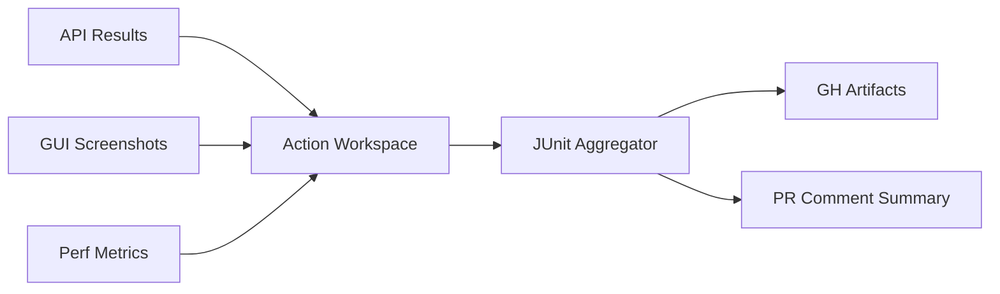

# 📊 Collect & Publish

!!! info "At a Glance"
    - **Category**: Core Engine
    - **Complexity**: Medium
    - **Recent Version**: v1.0.5 (Stable)
    - **Primary Tool**: Unified Test Reporter

Aggregate test results, screenshots, and performance reports into a single, high-fidelity PR summary.

---

## 🏗️ Data Flow

---

## 🛠️ Configuration

| Input | Default | Purpose |
| :--- | :--- | :--- |
| `reports-path` | `""` | Path to XML results. |
| `screenshots-path` | `""` | Pattern for PNG screenshots. |
| `junit-results-dir` | `junit-results` | Internal folder for merging. |
| `upload-artifacts` | `true` | Save files to GH storage. |
| `publish-results` | `true` | Post summaries to PRs. |

---

## 🚀 Pro Patterns

### 🔗 Integrated Screenshots
When screenshots are found, the action uploads them as a specific artifact named `gui-screenshots`, making them easily accessible for visual regression review.

### 🧪 JUnit Merging
The action automatically finds all `.xml` files in the `reports-path`, renames them to prevent collisions, and aggregates them into the `junit-results-dir`.

---

## 🆘 Troubleshooting

### ❌ No tests found in PR
**Issue**: The PR comment says "0 tests found".
**Solution**: Verify that your test runner (Pytest/Behave) is actually generating JUnit XML files in the path provided to `reports-path`.

---
[View Source Code](https://github.com/carlos-camara/qa-hub-actions/tree/main/collect-and-publish)
