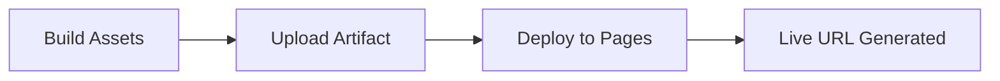

# 🌐 Deploy to GitHub Pages

!!! info "At a Glance"
    - **Category**: Reporting
    - **Complexity**: Low
    - **Recent Version**: v1.0.0 (Stable)
    - **Primary Tool**: actions/deploy-pages

Effortlessly host your Node.js based QA dashboards or static reports on GitHub Pages with automated builds.

---

## 🏗️ Deployment Flow

---

## 🛠️ Inputs

| Input | Default | Purpose |
| :--- | :--- | :--- |
| `node-version` | `20` | Environment for build. |
| `install-command` | `npm ci` | Dependency prep. |
| `build-command` | `npm run build` | Build generation. |
| `dist-dir` | `dist` | Assets to deploy. |

---

## 🚀 Pro Tips

### ⚡ Deterministic Builds
By using `npm ci` as the default `install-command`, the action ensures that your deployment environment exactly matches your `package-lock.json`, preventing "it works on my machine" issues.

---

## 🆘 Troubleshooting

### ❌ Permission Denied
**Issue**: Deployment fails with 403 error.
**Solution**: Ensure your GITHUB_TOKEN has `pages: write` and `id-token: write` permissions in your workflow.

---
[View Source Code](https://github.com/carlos-camara/qa-hub-actions/tree/main/deploy-gh-pages)
