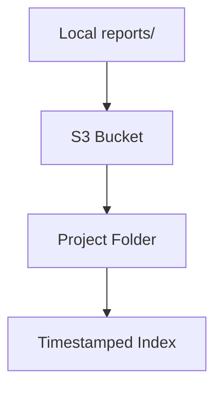

# ☁️ Deploy to AWS S3

!!! info "At a Glance"
    - **Category**: Reporting
    - **Complexity**: Medium
    - **Recent Version**: v1.0.1 (Stable)
    - **Primary Tool**: aws-actions/configure-aws-credentials

Securely archive your industrial-grade QA reports in AWS S3 for long-term retention and historical analysis.

---

## 🏗️ Storage Flow

---

## 🛠️ Inputs

| Input | Default | Description |
| :--- | :--- | :--- |
| `project-name` | `REQUIRED` | e.g., `dashboard`. |
| `s3-bucket` | `REQUIRED` | Destination bucket name. |
| `aws-region` | `us-east-1` | Target region. |

---

## 🚀 Integration Patterns

### 📂 Hierarchical Storage
This action automatically organizes reports by project name, creating a clean structure: `s3://bucket-name/project-name/runs/`.

### 🔐 Security First
The action sets up short-lived credentials, ensuring your AWS secrets are never exposed in plaintext during the deployment process.

---

## 🆘 Troubleshooting

### ❌ Bucket Not Found
**Issue**: Action fails to locate the destination.
**Solution**: Verify the `s3-bucket` input exactly matches the bucket name in your AWS Console.

---
[View Source Code](https://github.com/carlos-camara/qa-hub-actions/tree/main/deploy-reports-s3)
