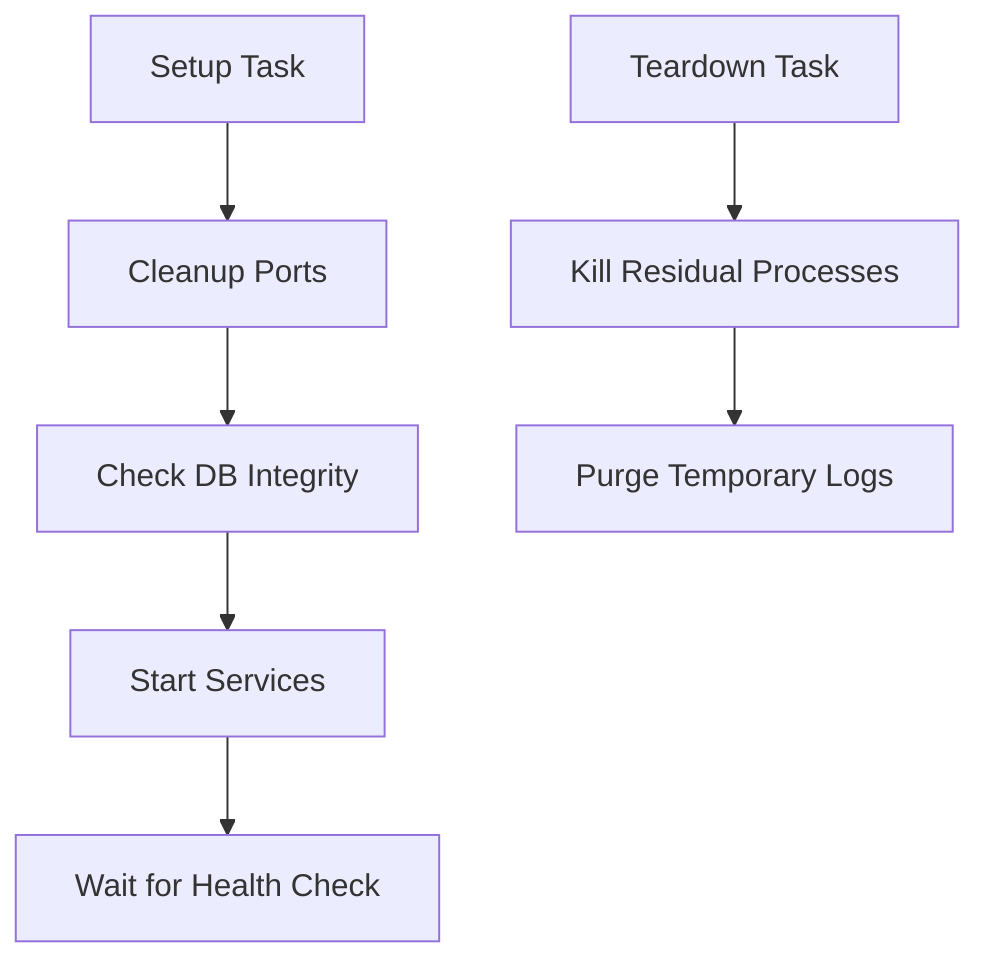

# 🏥 Action: Env Health & Teardown

<div align="center">
  <p><i>Ensure infrastructure stability before execution and perform surgical environment cleanup after testing to prevent flakiness and state leakage.</i></p>
</div>

---

> [!IMPORTANT]
> The **Environment Health & Teardown** action is your CI/CD's immune system. It runs deep pre-flight integrity checks (like SQLite corruption scanning) and ensures aggressive post-execution resource cleanup, guaranteeing 100% deterministic test runs without ghost processes.

## 🚀 Key Impact

- **🧹 Pre-flight Purification**: Automatically identifies and terminates orphaned processes on specified ports before starting tests.
- **🔍 Database Integrity**: Validates the health of SQLite databases (Integrity Check) and auto-recovers from corruption.
- **🚿 Surgical Teardown**: Ensures all background services (Node, Python) are terminated and temporary logs are purged.
- **🔄 Lifecycle Orchestration**: Seamlessly handles setup/startup and teardown/cleanup tasks in a single interface.

---

## 🏗️ Technical Lifecycle



---

## 🛠️ Configuration

| Input | Required | Default | Description |
| :--- | :---: | :---: | :--- |
| `task` | **Yes** | `setup` | Task to perform: `setup` or `teardown`. |
| `ports-to-clean` | No | `3000 3001` | Ports to purge of orphaned processes. |
| `start-services-command`| No | - | Optional command to launch background services. |
| `health-check-urls` | No | - | URLs to wait for before proceeding. |
| `db-path` | No | - | Path to SQLite DB for hardware integrity check. |

---

## ⚡ Quick Start

Drop this snippet into your workflow:

```yaml
steps:
  - name: 🏥 Prepare Infrastructure
    uses: carlos-camara/qa-hub-actions/environment-health-check@main
    with:
      task: 'setup'
      start-services-command: 'npm start &'
      health-check-urls: 'http://localhost:3000'
      db-path: 'data/qa.db'

  # ... Run Tests ...

  - name: 🧼 Surgical Teardown
    if: always()
    uses: carlos-camara/qa-hub-actions/environment-health-check@main
    with:
      task: 'teardown'
```

---

<div align="center">
  [View Full Wiki](https://carlos-camara.github.io/qa-hub-actions/actions/environment-health-check/)
</div>
