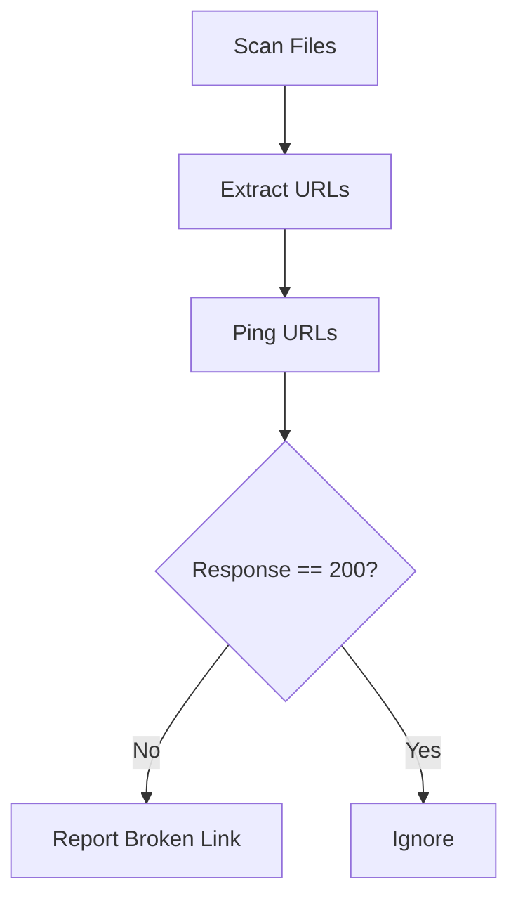

# 🔗 Link Checker

!!! info "At a Glance"
    - **Category**: Quality & Security
    - **Complexity**: Low
    - **Recent Version**: v1.0.0 (Stable)
    - **Primary Tool**: Lychee

Maintain documentation integrity. Automatically scans your files for broken or dead links.

---

## 🏗️ Scanning Flow

---

## 🛠️ Inputs

| Input | Default | Description |
| :--- | :--- | :--- |
| `search-path` | `**/*.md` | Files/Patterns to scan. |
| `fail-on-error` | `true` | Break build if link is dead. |

---

## 🚀 Pro Usage

### 🎯 Documentation Health
Integrate this action into your main documentation pipeline to ensure that your wiki always points to valid resources.

---

## 🆘 Troubleshooting

### ❌ Transient Failures
**Issue**: External websites are temporarily down.
**Solution**: If you have frequently failing stable links, consider adding them to an exclusion list if supported by your config.

---
[View Source Code](https://github.com/carlos-camara/qa-hub-actions/tree/main/link-checker)
