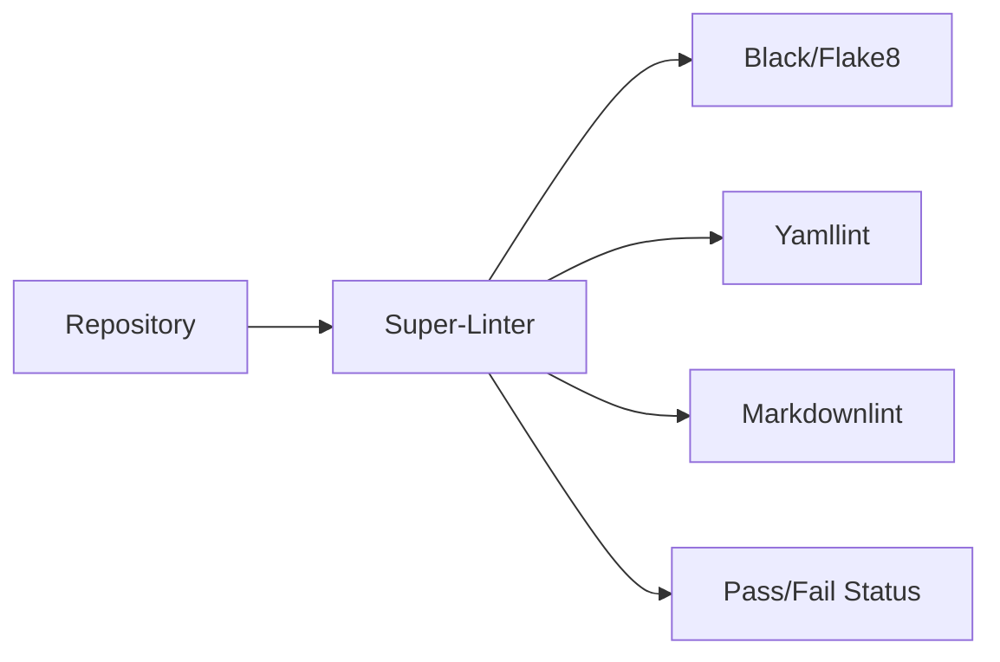

# 🧶 Lint Codebase

!!! info "At a Glance"
    - **Category**: Quality & Security
    - **Complexity**: Medium
    - **Recent Version**: v1.5.0 (Stable)
    - **Primary Tool**: Super-Linter

Unified linting engine that enforces a consistent style across Python, YAML, Markdown, and TS.

---

## 🏗️ Linting Strategy



---

## 🛠️ Inputs

| Input | Default | Purpose |
| :--- | :--- | :--- |
| `github-token` | `REQUIRED` | For posting status checks. |
| `validate-all` | `false` | Lint everything vs only changes. |
| `filter-regex-exclude` | `(node_modules\|dist\|...)` | Paths to ignore. |

---

## 🚀 Pro Usage

### 🎯 CI Optimization
Set `validate-all: 'false'` to only lint files that changed in the current Pull Request. This significantly reduces feedback time.

### 🧩 Custom Exclusions
If you have a vendor folder or legacy code, update the regex:
```yaml
with:
  filter-regex-exclude: "(.*/vendor/.*|legacy/)"
```

---

## 🆘 Troubleshooting

### ❌ MD041 Errors
**Issue**: First line should be a top-level heading.
**Solution**: Ensure every `.md` file starts with a `# Title`.

### ❌ MD007 Errors
**Issue**: Unordered list indentation errors.
**Solution**: Standardize on 2-space indentation for nested lists.

---
[View Source Code](https://github.com/carlos-camara/qa-hub-actions/tree/main/lint-codebase)
