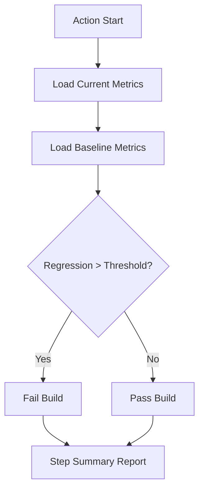

# 📉 Performance Baseline

!!! info "At a Glance"
    - **Category**: Quality & Security
    - **Complexity**: Low
    - **Recent Version**: v1.1.0 (Stable)
    - **Primary Tool**: JSON Compare Engine

Protect your UX. Automatically detect when API or GUI latency regressions exceed your tolerance.

---

## 🏗️ Logic Flow



---

## 🛠️ Inputs

| Input | Default | Purpose |
| :--- | :--- | :--- |
| `current-metrics` | `REQUIRED` | Path to JSON (e.g., `perf.json`). |
| `baseline-metrics`| `REQUIRED` | Path to baseline JSON. |
| `threshold` | `10` | Allowed % slowdown. |

---

## 🚀 Performance Gates

### 🎯 Tight Tolerance
For critical endpoints, set a lower threshold to catch even minor regressions:
```yaml
with:
  threshold: "5"  # Fail if 5% slower
```

### 📉 Report Example
The action generates a rich table in your Job Summary:
| Metric | Baseline | Current | Delta | Status |
| :--- | :--- | :--- | :--- | :--- |
| Search Latency | 120ms | 135ms | +12.5% | ❌ |

---

## 🆘 Troubleshooting

### ❌ JSON malformed
**Issue**: Action fails to read metrics.
**Solution**: Ensure your test runner outputs a standard flat JSON object with `{ "metric_name": numeric_value }`.

---
[View Source Code](https://github.com/carlos-camara/qa-hub-actions/tree/main/performance-baseline-check)
