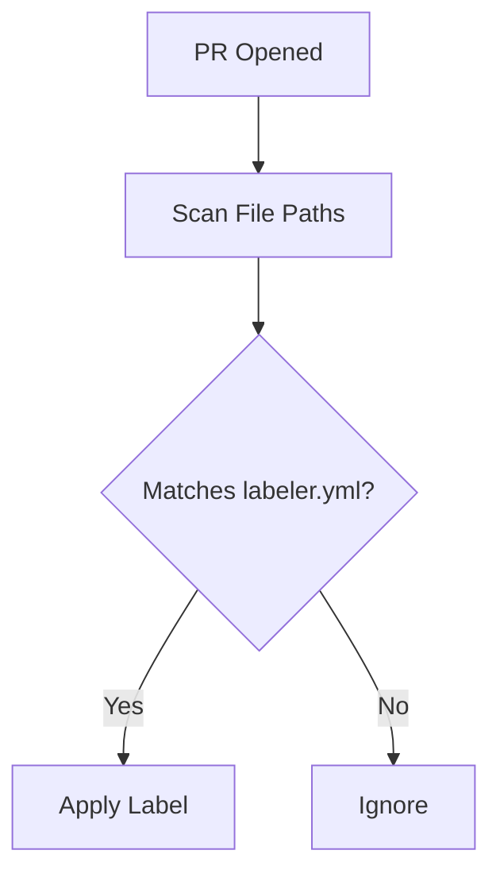

# 🏷️ PR Labeler

!!! info "At a Glance"
    - **Category**: Maintenance
    - **Complexity**: Low
    - **Recent Version**: v5.0.0 (Stable)
    - **Primary Tool**: actions/labeler

Automatically triage Pull Requests based on the file paths that were modified. Keep your project organized without manual effort.

---

## 🏗️ Labelling Logic



---

## 🛠️ Inputs

| Input | Default | Description |
| :--- | :--- | :--- |
| `configuration-path`| `.github/labeler.yml` | Rules file location. |
| `sync-labels` | `false` | Remove labels if files revert. |

---

## 🚀 Integration

### 📂 Configuration Example
Define your rules in `.github/labeler.yml`:
```yaml
DevOps:
  - ".github/workflows/**/*"
Documentation:
  - "**/*.md"
```

---

## 🆘 Troubleshooting

### ❌ Labels not appearing
**Issue**: PRs are opened but no labels are added.
**Solution**: Verify the `configuration-path` is correct and that the `labeler.yml` follows the official syntax.

---
[View Source Code](https://github.com/carlos-camara/qa-hub-actions/tree/main/pr-labeler)
