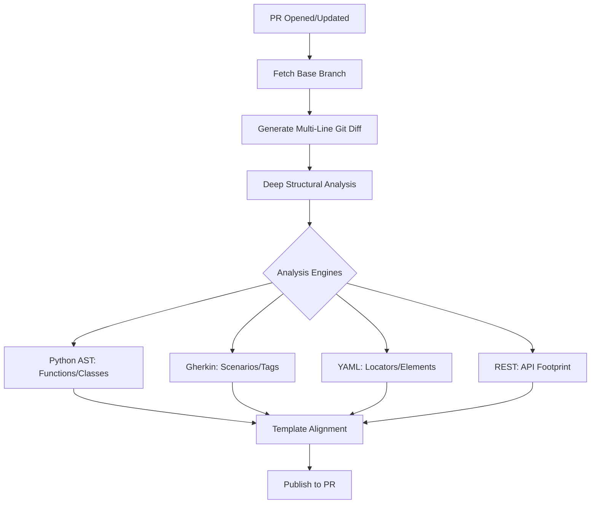

# 🤖 PR Summarizer

!!! info "At a Glance"
    - **Category**: Maintenance & Review
    - **Complexity**: High
    - **Recent Version**: v1.5.0 (New!)
    - **Primary Tool**: Python Structural Analysis (AST)

The **PR Summarizer** action provides an automated, ultra-deep technical summary of your Pull Request changes. It doesn't just list files; it analyzes the *intent* of the code changes.

---

## 🏗️ Architecture



---

## 🛠️ Configuration Details

| Input | Type | Default | Description |
| :--- | :--- | :--- | :--- |
| `github-token` | `String` | - | Required. Token for PR updates. |
| `domain-mapping` | `JSON` | `{}` | Optional overrides for path categorization. |
| `target` | `String` | `"description"` | Target placement (`description` or `comment`). |

---

## ✨ Premium Features

### 📊 Aesthetic Metric Tables
The action generates a visual impact table using Unicode block characters to show the "intensity" of changes per domain.

### badge Status Badges
Every technical insight is tagged with professional status markers:
- `[NEW]`: Freshly added functionality or scenario.
- `[MOD]`: Existing logic that has been refined.
- `[FIX]`: Targeted patches (detected from PR title/diff).

### 🌐 API Footprint
Automatically expands the summary to include modified REST endpoints (e.g., `PUT /api/incidents`) based on route definition changes in the code.

---

## 🚀 Advanced Usage

### 🎨 Custom Template Alignment
The action prioritizes your repo's `.github/pull_request_template.md`. It searches for standard headers like `## 🏗️ Technical Details` and injects its findings right below them.

```yaml
- uses: carlos-camara/qa-hub-actions/pr-summarizer@main
  with:
    github-token: ${{ secrets.GITHUB_TOKEN }}
    target: 'comment'  # Post as a bot comment instead of editing description
```

---
[View Source Code](https://github.com/carlos-camara/qa-hub-actions/tree/main/pr-summarizer)
