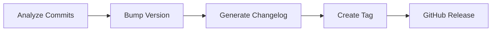

# 🚀 Python Auto-Release

!!! info "At a Glance"
    - **Category**: Maintenance
    - **Complexity**: Medium
    - **Recent Version**: v1.1.0 (Stable)
    - **Primary Tool**: python-semantic-release

Automate your entire release lifecycle: Versioning, Changelog generation, Tagging, and GitHub Releases.

---

## 🏗️ Release Lifecycle

---

## 🛠️ Inputs

| Input | Default | Purpose |
| :--- | :--- | :--- |
| `github-token` | `REQUIRED` | To create Tags/Releases. |
| `python-version` | `3.11` | Environment to run tool. |

---

## 🚀 Pro Patterns

### 📝 Conventional Commits
This action relies on **Conventional Commits** (e.g., `fix:`, `feat:`, `feat!:`) to determine the magnitude of the version bump.

---

## 🆘 Troubleshooting

### ❌ No release generated
**Issue**: Action completes but no tag/release is created.
**Solution**: Ensure you are using the correct commit prefix and that the `python-semantic-release` configuration in `pyproject.toml` is present.

---
[View Source Code](https://github.com/carlos-camara/qa-hub-actions/tree/main/python-auto-release)
