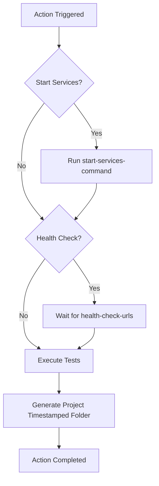

# 🧪 Run QA Test Suite

!!! info "At a Glance"
    - **Category**: Core Engine
    - **Complexity**: High
    - **Recent Version**: v1.2.0 (Stable)
    - **Primary Tool**: Pytest / Behave / Locust

The unified execution engine for all your testing needs. High-concurrency support, service health checks, and standardized reporting stashing.

---

## 🏗️ Architecture



!!! info "Intelligent Reporting"
    This action automatically organizes all JUnit XML output into a unique, timestamped folder for each run (e.g., `reports/test_run/dashboard_2026-02-12_11-16-47/`). This prevents test results from a multi-engine workflow (API + GUI) from overwriting each other.

---

## 🛠️ Configuration Details

| Input | Type | Default | Description |
| :--- | :--- | :--- | :--- |
| `start-services-command` | `String` | `""` | [DEPRECATED] Command to start your app. Use `setup-services` action. |
| `health-check-urls` | `String` | `""` | [DEPRECATED] Space-separated URLs to wait for. Use `setup-services` action. |
| `test-command-api` | `String` | `""` | Command for API tests (e.g., `pytest tests/api`). |
| `test-command-gui` | `String` | `""` | Command for GUI tests (e.g., `npm run test:gui`). |
| `test-command-performance` | `String` | `""` | Command for Performance tests (e.g., `locust -f locustfile.py`). |
| `project-name` | `String` | `"dashboard"` | Name of the project. Used for folder naming. |
| `enable-coverage` | `Boolean`| `false`| Whether to collect code coverage. |

!!! success "Simplified execution"
    You no longer need to pass boolean flags like `run-api: true`. The action now automatically detects which tests to run based on the presence of the corresponding test command. This reduces redundancy and makes your workflows cleaner.

---

## 🚀 Advanced Usage

### 📊 Coverage Mapping
When `enable-coverage` is set to `true`, the action automatically wraps your command with `pytest --cov`.

```yaml
- uses: carlos-camara/qa-hub-actions/run-tests@v1
  with:
    test-command-api: "pytest tests/"
    enable-coverage: 'true'
    coverage-module: "app_logic"
```

### 🖱️ GUI Headless Control
Toggle between headless and headed execution using the `headless` parameter.

```yaml
- uses: carlos-camara/qa-hub-actions/run-tests@v1
  with:
    test-command-gui: "behave features/"
    headless: 'false'  # Set to false for debugging
```

---

## 🆘 Troubleshooting

### ❌ Health check timeout
**Issue**: The action fails during the "Wait for Services" step.
**Solution**:
1. Increase the timeout in your app's startup or verify the `health-check-urls` are correct.
2. Ensure you backgrounded your app (e.g., using `&` in Linux).

### 🔍 Missing Reports
**Issue**: Tests pass but reports are not stashed.
**Solution**: Standardize your test command to output to a folder named `reports`.

---
[View Source Code](https://github.com/carlos-camara/qa-hub-actions/tree/main/run-tests)
