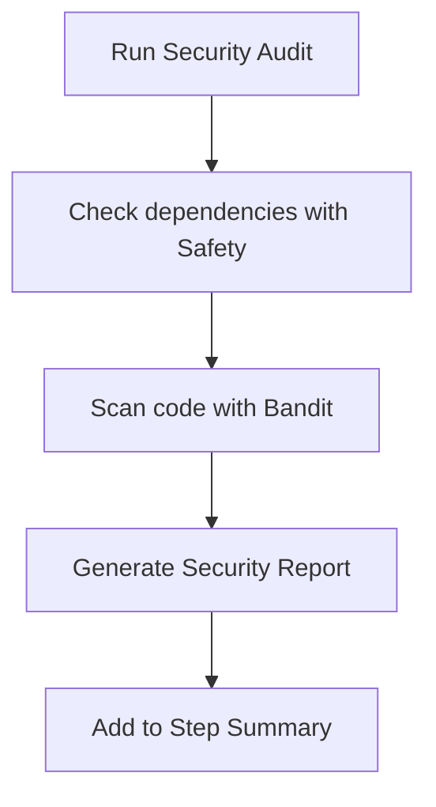

# 🛡️ Security Audit

!!! info "At a Glance"
    - **Category**: Quality & Security
    - **Complexity**: Low
    - **Recent Version**: v1.0.0 (Stable)
    - **Primary Tool**: Safety / Bandit

Automated vulnerability scanning for your QA stack. Detects CVEs in dependencies and security anti-patterns in code.

---

## 🏗️ Security Flow



---

## 🛠️ Parameters

| Input | Default | Description |
| :--- | :--- | :--- |
| `target-path` | `.` | Directory to scan for code vulnerabilities. |
| `scan-dependencies` | `true` | Toggle Safety check. |
| `scan-code` | `true` | Toggle Bandit scan. |

---

## 🚀 Advanced Security

### 🚭 Excluding Paths
By default, the audit scans everything. To focus on your core logic:
```yaml
- uses: carlos-camara/qa-hub-actions/security-audit@v1
  with:
    target-path: "my_package/"
```

### 🚨 Failing the Build
This action will fail the build if it finds **High** severity vulnerabilities, acting as a mandatory security gate for PRs.

---

## 🆘 Troubleshooting

### ❌ Known Vulnerabilities Found
**Issue**: Build fails due to security findings.
**Solution**: 
- **Safety**: Update the failing dependency in `requirements.txt`.
- **Bandit**: Review the reported line and apply recommended security fix (e.g., avoid `eval()`, use secure temp files).

---
[View Source Code](https://github.com/carlos-camara/qa-hub-actions/tree/main/security-audit)
