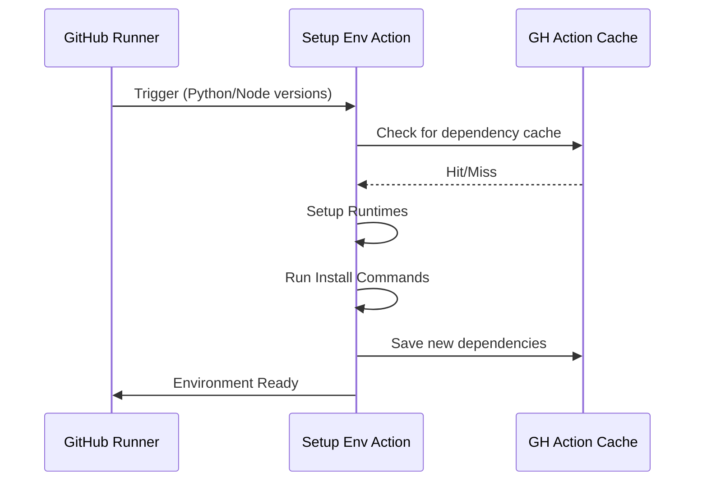

# ⚙️ Setup Environment

!!! info "At a Glance"
    - **Category**: Core Engine
    - **Complexity**: Low
    - **Recent Version**: v1.1.0 (Stable)
    - **Primary Tool**: setup-python / setup-node

One-stop configuration for multi-runtime QA projects. Automatic caching and dependency management for Python and Node.js.

---

## 🏗️ Architecture



---

## 🛠️ Inputs

| Input | Description | Best Practice |
| :--- | :--- | :--- |
| `python-version` | e.g., `3.11`. | Leave empty if your project is pure Node. |
| `node-version` | e.g., `20`. | Leave empty if your project is pure Python. |
| `python-install-command` | CLI to install deps. | Use `pip install -e .` for framework development. |
| `node-install-command` | CLI to install deps. | Use `npm ci` for deterministic builds. |

---

## 🚀 Advanced Interaction

### 📦 Optimized Caching
This action automatically caches `pip` and `npm` folders based on `requirements.txt` and `package-lock.json`. This typically reduces workflow time by **30-50%**.

### 🛠️ Custom Tooling
If you need additional global tools, use the install commands:
```yaml
- uses: carlos-camara/qa-hub-actions/setup-environment@v1
  with:
    python-version: '3.12'
    python-install-command: "pip install black flake8"
```

---

## 🆘 Troubleshooting

### ❌ Python installation failure
**Issue**: `pip` fails to install dependencies.
**Solution**: Ensure your `requirements.txt` is in the root directory or customize the `python-install-command` to point to the correct path.

---
[View Source Code](https://github.com/carlos-camara/qa-hub-actions/tree/main/setup-environment)
