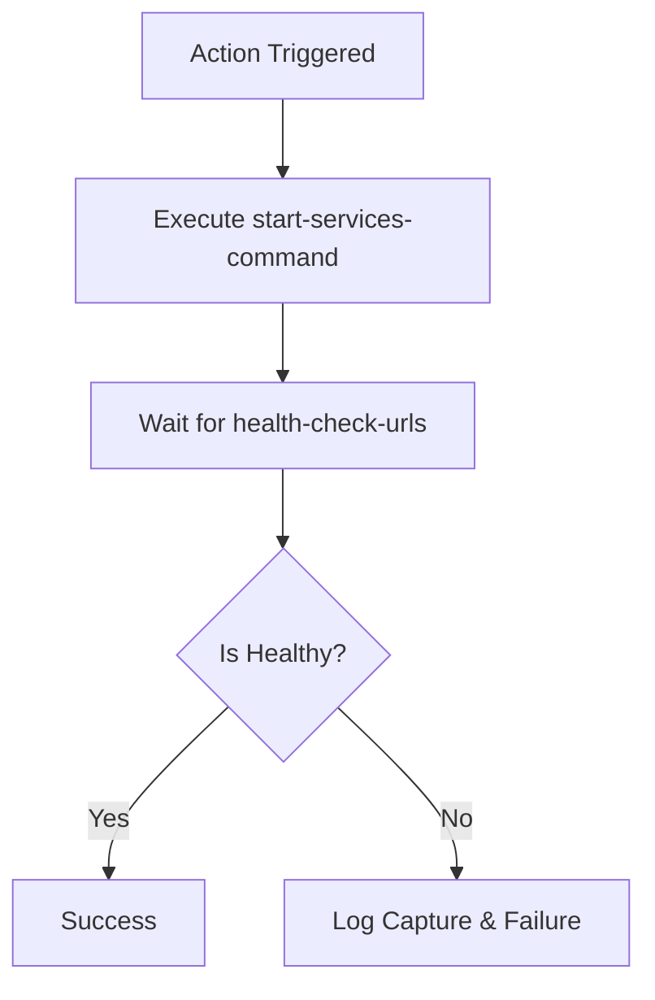

# 🚀 Setup Services

!!! info "At a Glance"
    - **Category**: Orchestration
    - **Complexity**: Low
    - **Recent Version**: v1.0.0 (New)
    - **Primary Tool**: npx wait-on

Decouple your service startup logic from test execution. Use this action to ensure your application is healthy and responsive before firing off expensive test suites.

---

## 🏗️ Architecture



---

## 🛠️ Configuration Details

| Input | Type | Default | Description |
| :--- | :--- | :--- | :--- |
| `start-services-command` | `String` | **Required** | The shell command to bring up your infrastructure. |
| `health-check-urls` | `String` | **Required** | One or more URLs (space-separated) to monitor. |
| `health-check-timeout` | `String` | `60000` | How long (ms) to wait before timing out. |

---

## 🚀 Examples

### Standard Web App
```yaml
- uses: carlos-camara/qa-hub-actions/setup-services@v1
  with:
    start-services-command: "npm run dev &"
    health-check-urls: "http://localhost:3000"
```

### Multi-tier Microservices
```yaml
- uses: carlos-camara/qa-hub-actions/setup-services@v1
  with:
    start-services-command: "./start-all.sh"
    health-check-urls: "http://localhost:8080/health http://localhost:8081/health"
    health-check-timeout: "120000"
```

---

## 🆘 Troubleshooting

### ❌ Port Collision
**Issue**: Services fail to start because a port is already in use.
**Solution**: Ensure you are using a clean runner or that your startup command handles existing processes.

### 🔍 Missing Logs
**Issue**: The action fails but no logs are shown.
**Solution**: Ensure your `start-services-command` redirects output to `backend.log` or `frontend.log` (e.g., `cmd > backend.log 2>&1 &`).

---
[View Source Code](https://github.com/carlos-camara/qa-hub-actions/tree/main/setup-services)
