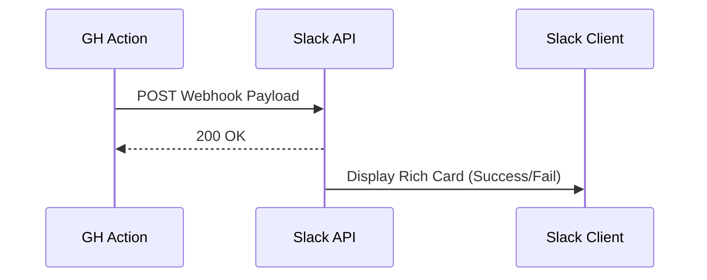

# 📢 Slack Notification

!!! info "At a Glance"
    - **Category**: Reporting
    - **Complexity**: Low
    - **Recent Version**: v1.0.2 (Beta)
    - **Primary Tool**: Slack Webhooks

Keep the whole team in the loop. Posts rich summaries of test cycles directly to your Slack channels.

---

## 🏗️ Notification Flow

---

## 🛠️ Inputs

| Input | Default | Description |
| :--- | :--- | :--- |
| `slack-webhook-url` | `REQUIRED` | Your channel's webhook URL. |
| `status` | `success` | Result state (success/failure/cancelled). |
| `test-summary` | `Tests passed` | Main message body. |

---

## 🚀 Pro Tips

### 🎨 Color-coded Alerts
The action automatically changes the card color based on the `status`:
- `success` -> **Green** ✅
- `failure` -> **Red** ❌
- `cancelled` -> **Grey** ⚠️

### 🔗 Deep Linking
The notification automatically includes a direct link to the GitHub Action run that triggered it, saving developers valuable seconds during triage.

---

## 🆘 Troubleshooting

### ❌ 404 No Service
**Issue**: Webhook call fails.
**Solution**: Verify the webhook URL hasn't expired or been deleted in Slack's App management.

---
[View Source Code](https://github.com/carlos-camara/qa-hub-actions/tree/main/slack-notify)
