# 🤖 QA Hub Actions

  

    Standardize. Accelerate. Audit.  
    The definitive collection of enterprise-grade reusable GitHub Actions.
  

[:octicons-arrow-right-24: Getting Started](installation.md){ .md-button .md-button--primary }
[:octicons-code-24: View Example](https://github.com/carlos-camara/qa-hub-framework/tree/main/.github/workflows){ .md-button }

---

## 📦 Action Ecosystem

Explore our modular components designed to work in synergy.

-   :material-engine: __Core Engine__

    ---

    The heartbeat of every pipeline. Setup, health, and execution.

    [:octicons-arrow-right-24: Run Tests](actions/run-tests.md)
    [:octicons-arrow-right-24: Setup Env](actions/setup-environment.md)
    [:octicons-arrow-right-24: Collect](actions/collect-and-publish.md)

-   :material-shield-check: __Security & Quality__

    ---

    Protect your code and dependencies with automated audits.

    [:octicons-arrow-right-24: Security Audit](actions/security-audit.md)
    [:octicons-arrow-right-24: Linting](actions/lint-codebase.md)
    [:octicons-arrow-right-24: Links](actions/link-checker.md)

-   :material-chart-box: __Reporting__

    ---

    High-fidelity visibility across Slack, S3, and Pages.

    [:octicons-arrow-right-24: Slack](actions/slack-notify.md)
    [:octicons-arrow-right-24: S3 Sync](actions/deploy-reports-s3.md)
    [:octicons-arrow-right-24: Pages](actions/deploy-gh-pages.md)

-   :material-robot-industrial: __Maintenance__

    ---

    Automate releases, labeling, and versioning protocols.

    [:octicons-arrow-right-24: Release](actions/python-auto-release.md)
    [:octicons-arrow-right-24: Labeler](actions/pr-labeler.md)
    [:octicons-arrow-right-24: Results](actions/upload-results.md)

---

## ⚡ The Architecture

All actions are designed to minimize boilerplate and maximize reliability.

```mermaid
graph LR
    Setup["Setup Environment"] --> Run["Run QA Suite"]
    Run --> Collect["Collect Results"]
    Collect --> Notify["Slack / Pages / S3"]
    
    subgraph AuditGroup ["🛡️ Security Gates"]
        Audit["Security Audit"]
        Lint["Lint Codebase"]
    end
    
    Run -. Parallel .-> AuditGroup
```

---

  <i>Built for performance. Engineered for quality.</i>

