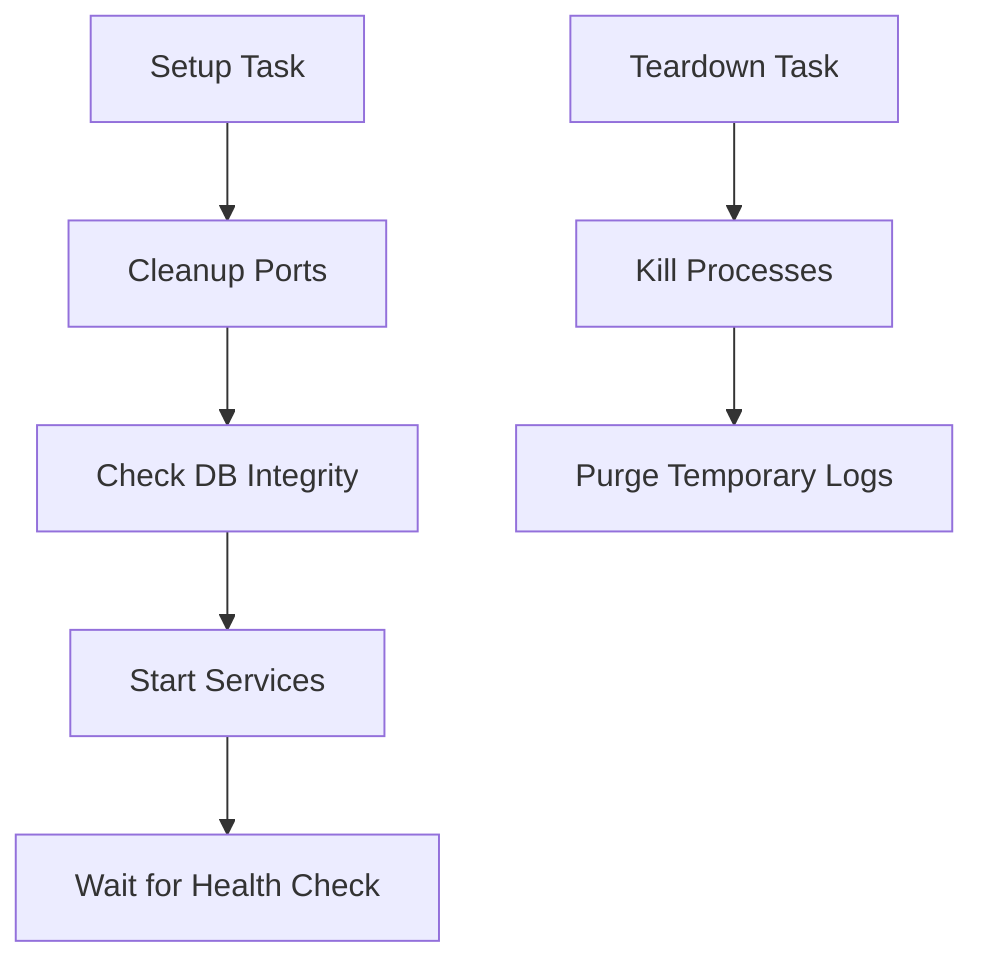

# 🛡️ Action: Environment Health Check & Teardown

> Ensure infrastructure stability before tests and perform surgical cleanup after execution.

---

## ✨ Key Features

- **🧹 Pre-flight Purification**: Automatically identifies and terminates orphaned processes on specified ports before starting tests.
- **🔍 Database Integrity**: Validates the health of SQLite databases (PRAGMA check) and auto-recovers from corruption.
- **🚿 Surgical Teardown**: Ensures all background services are terminated and temporary logs are purged, regardless of test outcome.
- **🔄 Lifecycle Orchestration**: Seamlessly integrates with `setup-services` for unified environmental management.

---

## 🚀 Usage

### Standard Setup & Teardown

```yaml
jobs:
  test:
    runs-on: ubuntu-latest
    steps:
      - uses: actions/checkout@v4
      
      # 1. Setup Environment
      - name: Prep Infrastructure
        uses: carlos-camara/qa-hub-actions/environment-health-check@main
        with:
          task: 'setup'
          start-services-command: 'npm start &'
          health-check-urls: 'http://localhost:3000'
          db-path: 'data/database.sqlite'
          ports-to-clean: '3000 3001'

      # 2. Run Tests
      - name: Execute Tests
        run: npm test

      # 3. Teardown (Always runs)
      - name: Cleanup
        if: always()
        uses: carlos-camara/qa-hub-actions/environment-health-check@main
        with:
          task: 'teardown'
          ports-to-clean: '3000 3001'
```

---

## 🏗️ Architecture



---

## 📄 Inputs

| Input | Description | Default |
| :--- | :--- | :--- |
| `task` | `setup` or `teardown` | `setup` |
| `start-services-command` | Command to launch background services | - |
| `health-check-urls` | URLs to wait for before proceeding | - |
| `db-path` | Path to SQLite DB for integrity check | - |
| `ports-to-clean` | Ports to purge of orphaned processes | `3000 3001` |
