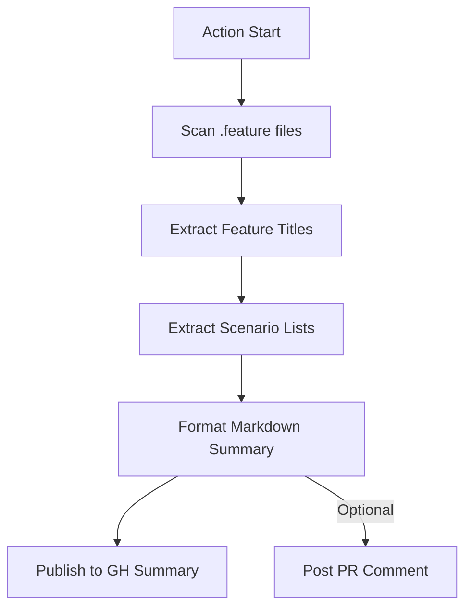

# <div align="center">📝 Action: QA Release Notes</div>

<div align="center">
  <p><i>Bridge the gap between technical automation and stakeholder visibility by generating high-fidelity, human-readable testing dossiers from your BDD feature files.</i></p>
</div>


---

## 🚀 Key Impact

- **📖 Gherkin Intelligence**: Surgically parses `.feature` files to extract professional titles and scenario checklists.
- **📊 Executive Dossiers**: Generates a structured overview of the testing scope directly in your Job Summary.
- **💬 Stakeholder Alignment**: Optionally posts the testing scope as a PR comment to inform Devs and PMs before merge.
- **🚀 Agile Transparency**: Ensures consistent visibility into automated coverage across every deployment.

---

## 🏗️ Technical Lifecycle



---

## 🛠️ Configuration

| Input | Required | Default | Description |
| :--- | :---: | :---: | :--- |
| `features-path` | No | `features` | Root directory to scan for `.feature` files. |
| `github-token` | No | - | Token required for PR commenting. |
| `publish-pr-comment`| No | `false` | Whether to post the summary as a PR comment. |

---

## ⚡ Quick Start

```yaml
- name: 📝 Generate QA Release Notes
  uses: carlos-camara/qa-hub-actions/qa-release-notes@main
  with:
    features-path: "features"
    publish-pr-comment: "true"
    github-token: ${{ secrets.GITHUB_TOKEN }}
```

---

<div align="center">
  [View Full Wiki](https://carlos-camara.github.io/qa-hub-actions/actions/qa-release-notes/)
</div>
