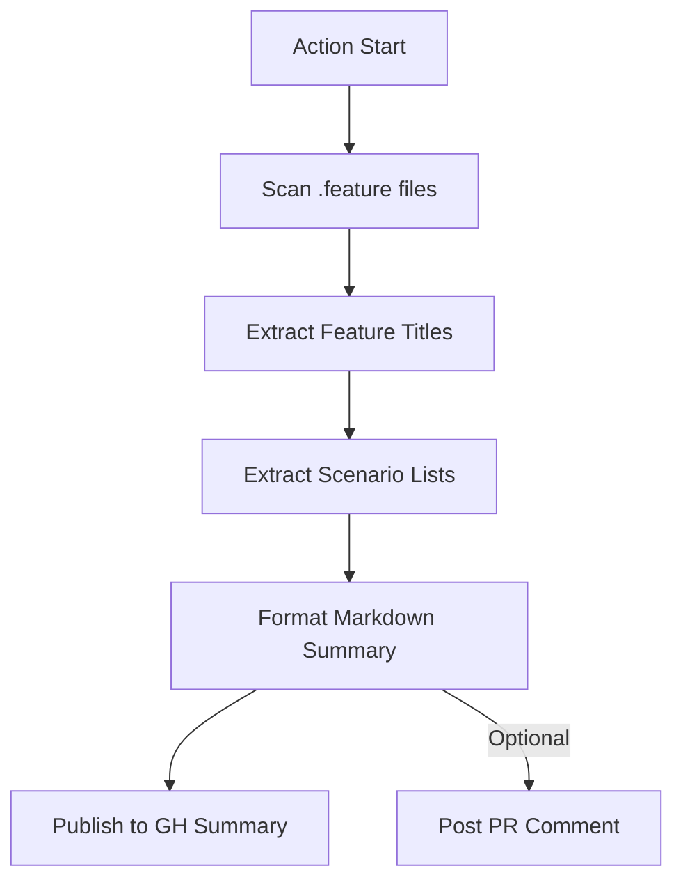

# 📝 Action: Automated QA Release Notes

> Bridge the gap between technical automation and stakeholder visibility.

---

## ✨ Key Features

- **📖 Gherkin Intelligence**: Directly parses `.feature` files to extract human-readable titles.
- **📊 Executive Summary**: Generates a clean, structured table of Features and Scenarios.
- **💬 PR Integration**: Can automatically comment on Pull Requests to keep Devs and PMs informed about what is being tested.
- **🚀 Agile Visibility**: Perfect for shifting left on testing visibility, ensuring the whole team knows the automated coverage before merge.

---

## 🚀 Usage

### PR Visibility Workflow

```yaml
name: QA Visibility

on:
  pull_request:
    types: [opened, synchronize]

jobs:
  summary:
    runs-on: ubuntu-latest
    steps:
      - uses: actions/checkout@v4
      
      - name: Generate QA Notes
        uses: carlos-camara/qa-hub-actions/qa-release-notes@main
        with:
          features-path: 'features'
          publish-pr-comment: 'true'
          github-token: ${{ secrets.GITHUB_TOKEN }}
```

---

## 🏗️ Architecture



---

## 📄 Inputs

| Input | Description | Default |
| :--- | :--- | :--- |
| `features-path` | Root directory to scan for BDD files | `features` |
| `github-token` | Token for PR commenting | - |
| `publish-pr-comment` | Whether to post a comment on the PR | `false` |
